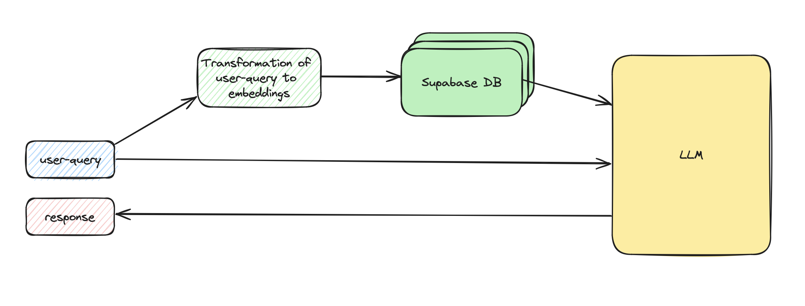

# Chatbot Backend Overview

The chatbot backend is powered by a Retrieval Augmented Generation (RAG) system designed to create rich conversations with a virtual assistant based on my persona. This system cleverly combines Large Language Models (LLMs) with a retrieval system that accesses a customized collection of my academic background, professional experiences and other significant events, all documented in multiple PDFs.

## Visualization of Workflow



## Description of Workflow

### Authentication

The system features a straightforward password-based authentication for secure and private chat access, ensuring that conversations are confidential and accessible only to authenticated users.

### Information Retrieval

To ensure you receive only the most pertinent information in response to your questions, the chatbot utilizes a sophisticated yet straightforward retrieval mechanism. As a preprocessing step, my personal PDF documents were segmented into chunks, converting these into embeddings, and subsequently storing them in a Supabase PostgreSQL database. When a query is posed, the system generates corresponding embeddings to accurately identify and retrieve the best-matching sections from the database using cosine similarity scores. This approach ensures that the answers you receive are not only directly relevant but also detailed, drawn from an extensive database of my experiences.

### Chat Functionality

Once the most pertinent chunks have been retrieved from the Supabase database, they are seamlessly integrated and sent to the LLM GPT-4 Turbo model. This LLM expertly utilizes the retrieved sections to craft responses to user queries, generating the output visible in the frontend. However, in longer conversations between the user and the chatbot, a chat history function comes into play. It functions by presenting the last two messages, one from the user and one from the chatbot, to the LLM for context. In cases where the chat history extends beyond this, the preceding messages are expertly summarized using the GPT-3.5 model, employing Langchain functionalities to maintain a concise and informative conversation flow.

---

## Run the Backend

### Run Poetry environment
```
poetry shell
```

### Navigate to src folder 
```
cd src
```

### Host
```
uvicorn main:app --host 0.0.0.0
```